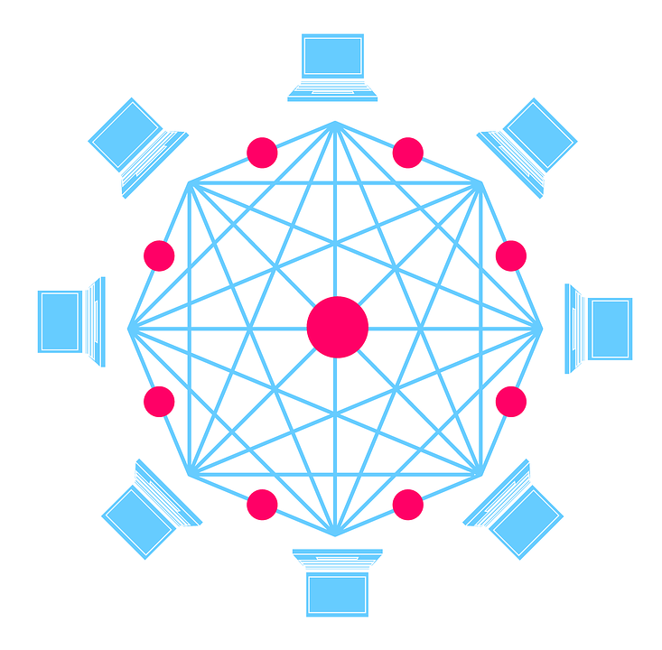

# Set Up a Local Network

First we will set up a local network with everyone else at this workshop.

You will need:

* A node configuration file:

	* Bootstrap Node Information
	* Telemetry Reporting URL
	* Initial genesis configuration
		* Some accounts with Balance
		* Some accounts assigned as Validators (block producers)
		* Initial runtime Wasm bytecode

Get that configuration file here:

https://bootnodes.net/spec.json

Take a look at the JSON!

<!-- slide:break -->

<!-- <button id="gen-button">Generate Keys</button>

	<textarea id="ed25519"></textarea>
	<textarea id="sr25519"></textarea>

 -->
