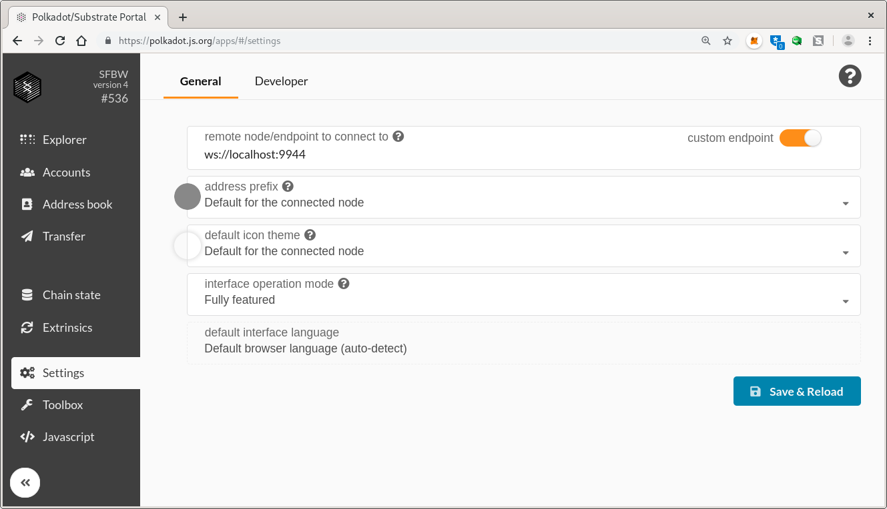

# Interact with Your Node

Now that you've joined the network, you can interact with your own node.

## With the Apps UI

In the Apps UI, go to the Settings tab, and change the endpoint to `ws://localhost:9944`.

> **NOTE:** You cannot use Firefox to connect to a non-secure WebSocket endpoint
> (`ws://`) from a secure webpage (`https://`). So you may need to use Chrome or
> a Chromium-based browser.

## Create an Account
Use the Acocunts tab and Add Account to create your own personal account. It will not have any tokens (yet).

## Import an Account
You may import the pre-funded Alice account and borrow some of her token. Download the [Alice Key File](https://sfbw.bootnodes.net/alice.json). That add her account using "Restore JSON"

<!-- slide:break -->

