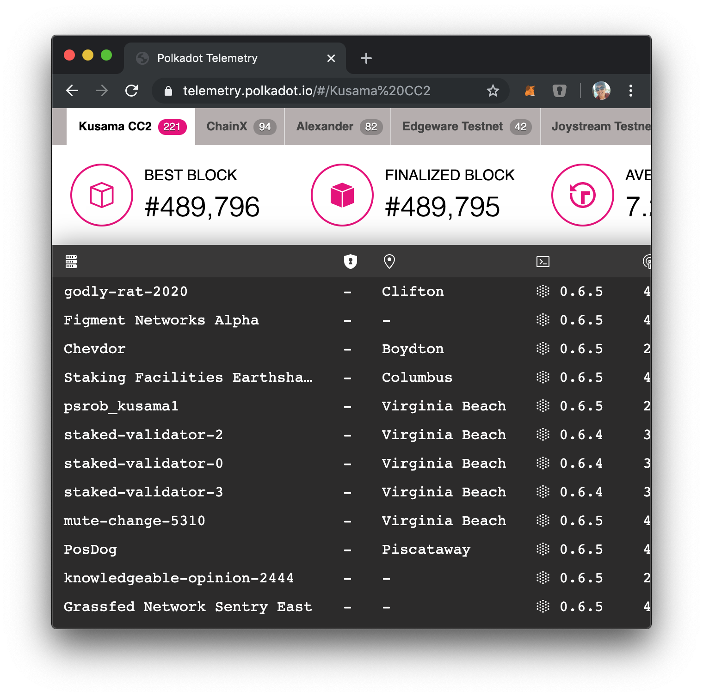

# View Public Telemetry

You can take a look at the overall network using the telemetry website:

[https://telemetry.polkadot.io/#list/SFBW](https://telemetry.polkadot.io/#list/SFBW)

Your node will connect to the telemetry server because of the `spec.json`:

```json
"telemetryEndpoints": [
    ["ws://telemetry.polkadot.io:1024", 0]
],
```

## Discussion

* Peer Discovery
* Network Topology

<!-- slide:break -->


