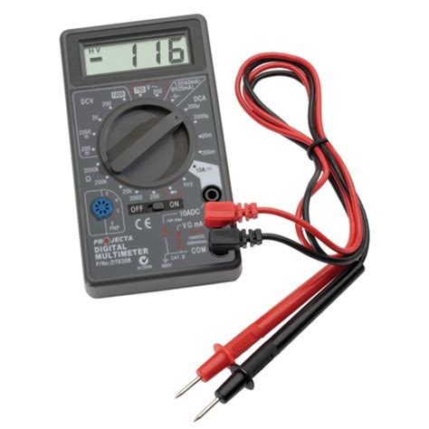

# Use Our Network

I've already started a network with two nodes. As a first step, let's try out this network as end-users.

## Apps UI

I think of this UI as a multimeter for Substrate-based blockchains.

You can try out the Apps UI at:

* [https://polkadot.js.org/apps/#/explorer?rpc=wss://bootnodes.net:9944](https://polkadot.js.org/apps/#/explorer?rpc=wss://bootnodes.net:9944)

You can see we have explicitly set the UI to use a WebSocket endpoint exposed at `wss://bootnodes.net:9944`. This can be changed on the Settings tab as we'll see shortly.

## Frontend Template

This React-based project serves as starting point for designing your own use-case-specific UIs.

If you're interested in experimenting with this project, you can clone it from:

* https://github.com/substrate-developer-hub/substrate-front-end-template/

<!-- slide:break-60 -->

