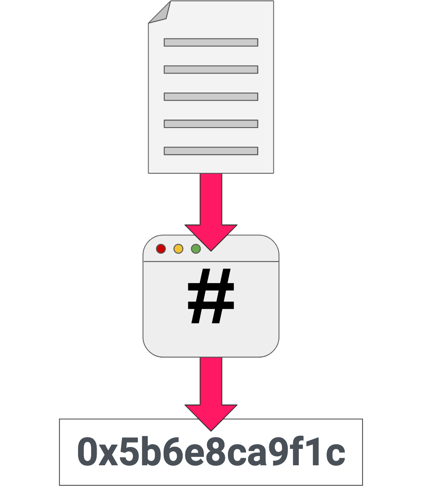

# Proof Of Existence Chain

The custom logic we will add to your Substrate runtime is a Proof of Existence
module. From [Wikipedia](https://en.wikipedia.org/wiki/Proof_of_Existence): 

> Proof of Existence is an online service that verifies the existence of
> computer files as of a specific time via timestamped transactions in the
> bitcoin blockchain.

Rather than uploading the entire file to the blockchain to "prove its
existence", users submit a [hash of the
file](https://en.wikipedia.org/wiki/File_verification), known as a file digest
or checksum. These digests are powerful because huge files can be uniquely
represented by a small hash value, which is efficient for storing on the
blockchain. Any user with the original file can prove that this file matches the
one on the blockchain by simply recomputing the hash of the file and compare it
with the hash stored on chain.

To add to this, blockchain systems also provide a robust account system. So when
a file digest is stored on the blockchain, we can also record which user
uploaded that digest. This allows that user to later prove that they were the
original person to claim the file.

Our Proof of Existence module will expose two callable functions:

* `create_claim` - allows a user to claim the existence of a file by uploading a
  file digest.

* `revoke_claim` - allows the current owner of a claim to revoke their
  ownership.

We will only need to store information about the proofs that have been claimed,
and who made those claims.

<!-- slide:break-60 -->

