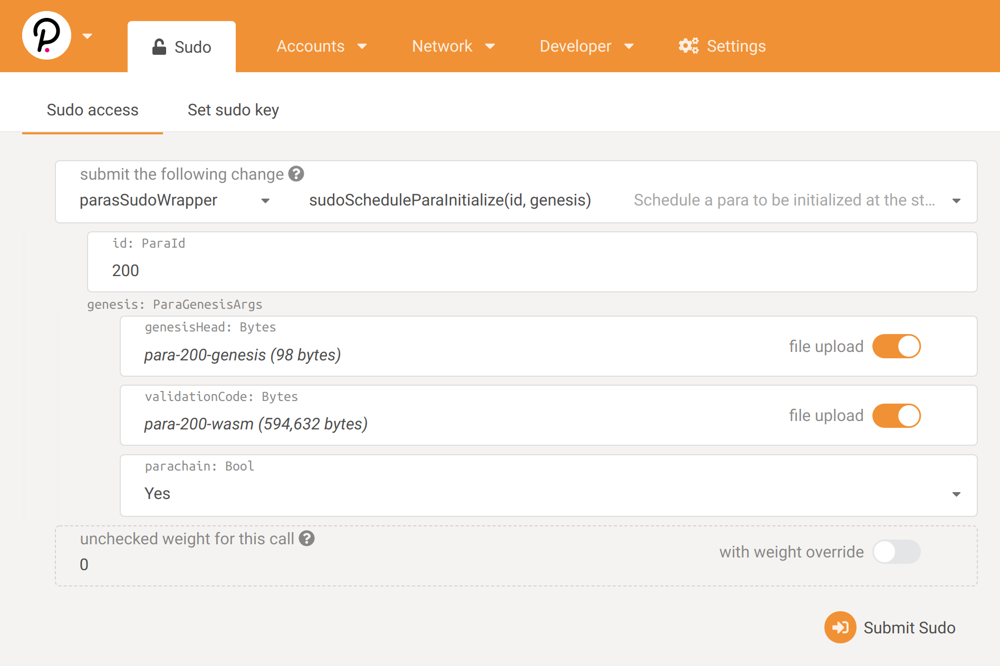

# Connecting the First Parachains

We'll begin by deploying the zero (TODO description) parachain.

## Generate Genesis State
To register a parachain, the relay chain needs to know the parachain's genesis state. To acheive that, we'll export the genesis state to a file.

```bash
./target/release/parachain-zero-collator export-genesis-state genesis-state-zero
```

## Start the collator node
```bash
./target/release/parachain-zero-collator --base-path collator-zero --chain WorkshopRelayChainRaw.json
```

## Registration Transaction
When Polkadot is live parachain slots will be auctioned. For the purpose of this workshop, we will skip the overhead of the auction, and instead use sudo transactions to force parachain registration. The transaction can be made from `Apps > Sudo > Registrar > registerPara`.

id: 0
ParaInfo: Always
code: from wbuild directory
initial_head_data: from previous step



## Other Pre-Written Parachains
The other pre-written parachains (TODO descriptions) can now be deployed similarly to before. When your collator node is ready, please let us know and we will submit the sudo transaction to register it on the relay chain.

If you're planning to connect a custom runtime, please proceed to the next page
