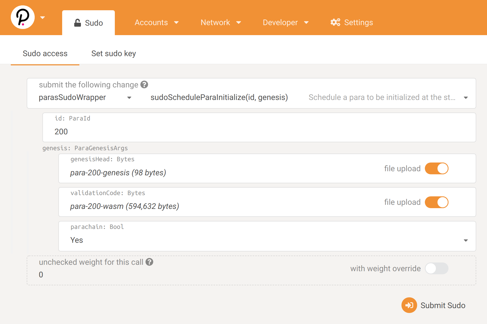

# Parachain Registration

We have our relay chain launched and our parachain collator ready to go. Now we have to register the parachain on the relay chain. In the live Polkadot network, this will be accomplished with parachain auctions. But today we will do it with Sudo.

## Registration Transaction

The transaction can be made from `Apps > Sudo > Registrar > registerPara` with the following parameters:

id: 0
ParaInfo: Always
code: para-200-wasm (from the previous step)
initial_head_data: para-200-genesis (from the previous step)



### Block Production
The collator should start producing parachain blocks (aka collating) once the registration is successful. The collator should start producing log messages like the following:
```
2020-06-23 07:28:24 Starting parachain attestation session on top of parent 0xd94fe34cd9708145308d7a2c1f1c0f1105997c5307258970249fd66e27d571bc. Local parachain duty is None
2020-06-23 07:28:24 🙌 Starting consensus session on top of parent 0x74be3a0a708a44fe5f2e16e1829ff3254d6870580297627c54af99a3ecdcfddf
2020-06-23 07:28:24 🎁 Prepared block for proposing at 1 [hash: 0x8ffba7e6194a3a960f9b4b7d0ce1d419d655f5f258f609eb910ddccb78b3d45c; parent_hash: 0x74be…fddf; extrinsics (3): [0xfe5c…5be2, 0x6d07…cb5a, 0x2259…cec2]]
2020-06-23 07:28:24 ✨ [Parachain] Imported #1 (0x8ffb…d45c)
```

### Updating Heads
The relay chain tracks the latest heads of each parachain. When a relay chain block is finalized, any parachain blocks that are referenced from it or any of its parents are also finalized. This is how polkadot achieves shared security. We can check whether new parachain blocks are being referenced by the relay chain by querying the chain state in `Apps > Chain state > parachains > heads`. You should see the value change every few blocks.
