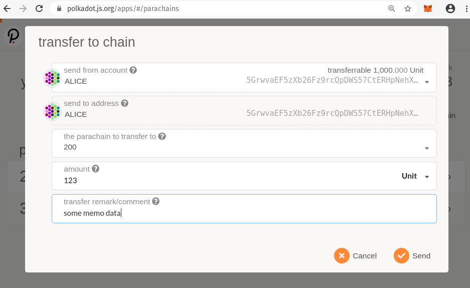

# Downward Transfers

Polkadot's XCMP (cross chain message passing) will allow transfer of arbitrary assets between
different blockchains. XCMP is still being developed, and may change significantly, but it is
already stable enough for demonstrations and experimentation. This workshop focuses on the _process_
of transferring tokens across chains. You can learn more about message passing in general with these
resources.

- [Messaging overview](https://github.com/paritytech/polkadot/blob/master/roadmap/implementers-guide/src/messaging.md)
- [Message format spec](https://github.com/paritytech/xcm-format)

## Depository and Mint Model

When sending DOTs from the relay chain to a parachain, we use a depository and mint model. The DOTs
leave the senders account on the Relay chain and are transferred into a parachain-specific account
on the relay chain. When the parachain receives a message that this transfer has happened, it mints
a corresponding amount of tokens in the specified account on the parachain.

## Sending Tokens Down

To send tokens from Alice's account on the Relay chain to her own account on parachain 200, you
submit a single transaction on the Relay chain. Return to the Apps instance that is connected to the
relay chain, navigate to the Parachains tab, and click the "Transfer to chain" button.

Fill in the details as you desire and submit the transaction.

## Confirming Receipt of DOTs

Once the transaction has processed on the Relay Chain, you should see the tokens show up in the
corresponding account on the Parachain. In the Apps instance that is connected to the Parachain,
inspect Alice's account balance and confirm that the tokens have arrived.

## Play More

This single transaction has demonstrated the fundamentals of sending tokens to parachains. But there
is much more to learn by playing around. Try sending sending tokens from different accounts and to
different parachains.
