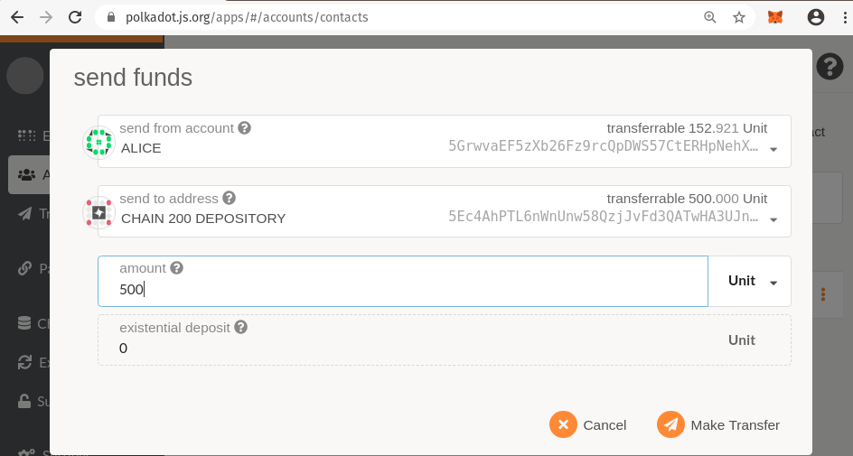

# Lateral Transfers

> In order to perform these steps, you must have two different parachains registered. If you have
> only a single parachain, skip this section.

> In this writeup we will assume your parachains are registered at IDs 200 and 300. If you have used
> different IDs modify these instructions accordingly.

## State of XCMP

Lateral Transfers will ultimately be accomplished via true XCMP with messages sent directly from one
parachain to another. This is not yet implemented, but we can still make cross chain transfers
relying on the Relay chain to deliver messages for us. The end result is the same, but we do not yet
expect the same performance we'll get when true XCMP is available. For more details, see
https://github.com/paritytech/polkadot/wiki/Cross-Chain-Message-(XCM)-format

## Depository Model

The cross chain transfers use a similar depository model as the downward transfers. However it does
not allow a chain to mint tokens backed by tokens on sibling chains because the sibling chains
cannot trust each other. That means in order to transfer tokens from chain 200 to chain 100, there
must already be tokens owned by chain 200 in a depository on chain 100.

> In my personal opinion this model does not make as much sense here, because there are not
> real-world circumstances that would lead chain 200 to have tokens on chain 100. This model may be
> re-visited in the future.

## Prefunding the Depository

Before we can transfer tokens from Alice's account on Chain 200 to her account on Chain 300, we must
ensure that Chain 200 has some tokens in it's dedicated account on chain 300. We will do this by
making a regular on transfer into the depository on the destination chain 300. Each parachain has an
account that acts as its depository, and you can learn the address of this account by watching the
logs when your collator first starts up. The account for parachain 200 is
`5Ec4AhPTL6nWnUnw58QzjJvFd3QATwHA3UJnvSD4GVSQ7Gop`

You can learn your own parachain's depository address by looking for a log like this:

```
2020-06-23 08:43:35 Parachain Account: 5Ec4AhPTL6nWnUnw58QzjJvFd3QATwHA3UJnvSD4GVSQ7Gop
```

<!-- this tip is not compatible with the --tmp flag as I've advised. consider removing the tip

> Protip, if this log is above the scroll for you, just kill your collator and restart it. It will produce the log
> message again.
-->

Using a UI connected to Parachain 300 (the recipient) make a regular balance transfer from any
account into the depository account.



## Sending Tokens Sideways

On Parachain 200 (the source) Submit the extrinsic return to the `Parachains` tab and the lonely
"transfer to chain" button.


## Confirming Receipt of Tokens

On parachain 100, look at the accounts tab. You should see the tokens transferred into Alice's
account and out of parachain 200's depository.

<!-- I did not observe this to be the case. Should it be? If not tokens are burned on the sending side but not minted anywhere

You can also confirm that on parachain 200 (the source) the tokens have been added to the Parachain 100's (the destination) depository. (The address for parachain 100 is `5Ec4AhP76KFCLR6Q8c8XFnN7pCW7uV2o6gyrBCZJYq1VEhdT`)
-->
