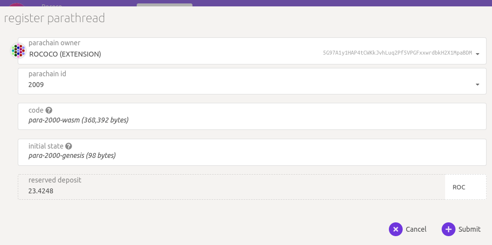

# Rococo

## Registration

Rococo is Parity's official test network for cumulus-based parachains.

> **IMPORTANT NOTE:** you _must_ use the _same_ commit for cumulus and polkadot `v0.9.3` branches
> to build your parachain against to be compatible!!! You _must_ test locally registering your
> parachain successfully before you attempt to connect to rococo!

**[Polkadot `release-v0.9.3` branch](https://github.com/paritytech/polkadot/tree/release-v0.9.3)**

**[Cumulus `polkadot-v0.9.3` branch](https://github.com/paritytech/cumulus/tree/polkadot-v0.9.3)**

This network is under _constant development_ - so expect to need to follow progress and update
your parachains in lock step with the rococo changes if you wish to connect to the network.

Do join the [rococo matrix chat room](https://matrix.to/#/#rococo:matrix.parity.io) to ask questions and connect
with the rococo teams.

### Request ROC Tokens

The symbol for the Rococo test network's native currency is ROC. You will need some ROC in order to
register your Rococo parachain.

To experiment on Rococo _before_ you need to register, and to encourage your team as supporters in
things like crowdloans on Rococo, do **not** use the main chat, instead, _Please_ use our
[rococo faucet channel](https://matrix.to/#/#rococo-faucet:matrix.org) to request a few ROC tokens.

As you will need more than the faucet practically allows for to register, please join and ask in
the [rococo matrix chat room](https://matrix.to/#/#rococo:matrix.parity.io), one of the Parity team
will get you setup if you let us know (with some proof) that you have a parachain ready to register.

[request some ROC](en/6-register/1-register?id=request-roc-tokens) an account first via the faucet. 

### Register as a Parathread

All Parachains will need to Register. There is a 5 ROCs deposit to register the parachain id.

- [Reserve a _unique_ `para_id`](en/2-relay-chain/2-reserve). This will be assigned taking the next
 available id.
- This integer will be greater than `2000`, as `0-999` are _reserved_ for systems parachains and
  `1000-1999` are _reserved_ for common good parachians.
- `initial_head_state`: your parachain's genesis state ([Same process as before](../3-parachains/1-launch.md#generate-parachain-genesis-state))
- `validation_function`: the Wasm runtime for your parachain ([Same process as before](../3-parachains/1-launch.md##obtain-wasm-runtime-validation-function))

[apps UI here](https://polkadot.js.org/apps/?rpc=wss%3A%2F%2Frococo-rpc.polkadot.io#/parachains/parathreads)

Reserve the next available parachain id.

After successfully reserving your para id, you can now register the **ParaThread**. 

If your extrinsic succeeds, you will see this in the explorer's block data:

And that your parathread registration is *onboarding*:

> After submission of this data, it will take **2 sessions** ([see below](#relevant-values) for length)
> for the candidate to fully onboard to a Parathread.

## Parachain Slot Auction

Paratheads can elect to become parachains, where their PoV inclusion in the relay chain is 
guaranteed for the slot duration they are alloted. Systems parachains will bypass auctions, but 
all normal chains (including yours) will need to win a parachain slot auction to get one!

> Only fully onboarded rococo parathreads are eligible to bid in a rococo parachain slot auction. 

### Relevant Values

> Note that these are example values; all are subject to change.

- Session length: 10 min
- Lease Period Length: 1 Day = 14400 Blocks
- Ending Period: 60 Min = 600 Blocks
- Current Lease Period Index = Current Block Number / 14400

> Note: All transitions of a Para* into different states will take at least 2 sessions (onboarding,
> offboarding, upgrading, downgrading, etc.)

### Bidding

Anyone with a **fully onboarded parachain** registered can make a bid to win a parachain slot for their Para ID.
This can be done independently, assuming this individual account can out-bid all others participating in the
slot auction.
Do so via the [apps UI](https://polkadot.js.org/apps/?rpc=wss%3A%2F%2Frococo-rpc.polkadot.io#/parachains/auctions):

Pick your Para ID, how much you want to bid, and the slots you want to bid for:

### Crowdloans

If you _cannot_ (or would rather not) win a slot with the ROCs you have in a single account, you 
must gather the support of the Rococo community and start a crowdloan that your supporters can
loan you their ROC to win the auction.

#### Start a Crowdloan

Important notes:

- You can only create a crowdloan for a Para ID that you own / have registered.
- The crowdfund cap is the MAXIMUM amount your crowdloan can collect. You can still win a bid if you
  have less than your maximum, as long as your bid is the best in the auction.
- Ending Block is when you want your crowdloan to end. If you know an auction will start in 3 days,
  and will last for 5 days, you probably want to set your crowdloan to end in 10 days, or a similar
  timescale. This way you will be sure that your crowdloan is active during the entire auction
  process.
- You don't want to set your crowdloan to be too long, or else you will lock up users funds for a
  long time and they may not want to participate.
- The first slot must be the first slot you want to bid for. So if the current auction is for slots
  (3, 4, 5, 6), your first slot can be at least 3.
- Last slot must be with within that range too.
- You can cancel a crowdloan (if you made a mistake), as long as you did not receive a contribution.

If your extrinsic succeeds, you will get:

#### Fund a Crowdloan

Any Account with a free ROC ballance and elect to contribute to your crowdloan, including the 
same account that started this crowdloan to begin with from 
[the apps UI](https://polkadot.js.org/apps/?rpc=wss%3A%2F%2Frococo-rpc.polkadot.io#/parachains/crowdloan):

Spread the word on the [rococo matrix chat room](https://matrix.to/#/#rococo:matrix.parity.io) about
your parachain, and rally support to have others loan you the funds you need to win a slot!