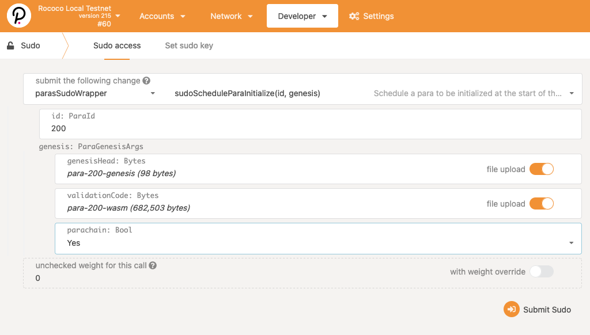
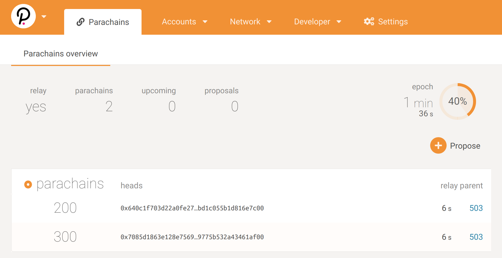

# 注册平行链

我们有我们启动了的中继链，而且我们的平行链收集者准备去注册。现在我们必须在中继链上注册平行链。在实时的Polkadot网络中，
这会通过[平行链-拍卖](https://wiki.polkadot.network/docs/en/learn-auction)来完成。但是现在，我们使用Sudo来完成平行链的注册。
We have our relay chain launched and our parachain collator ready to go. Now we have to register the
parachain on the relay chain. In the live Polkadot network, this will be accomplished with
[parachain auctions](https://wiki.polkadot.network/docs/en/learn-auction). But today we will do it
with Sudo.

## 注册交易

这个交易可以通过`Apps > Sudo > Registrar > registerPara`进行，参数如下：


- id: `200`
- ParaInfo: `Always`
- code: upload the file `para-200-wasm` (from the previous step)
- initial_head_data: upload the file `para-200-genesis` (from the previous step)



### 区块生产

一旦成功注册后，收集者应该启动了生产平行链的区块(即排序)。收集者应该开始生成如下所示的日志信息：


```
2020-08-11 14:00:06 ✨ [Relaychain] Imported #28 (0x639d…d95b)
2020-08-11 14:00:06 🙌 Starting consensus session on top of parent 0xfbcfd7080ac31c2988240a6045217076b6debb3e70d4ad543f5cd09c96040630
2020-08-11 14:00:06 🎁 Prepared block for proposing at 1 [hash: 0x44a35ad9a5a6073a187a3e33022dfb40cbc96c5859fe790d710077ae426bc205; parent_hash: 0xfbcf…0630; extrinsics (3): [0x450c…68b5, 0x5dba…b245, 0x2259…cec2]]
2020-08-11 14:00:06 ✨ [Parachain] Imported #1 (0x44a3…c205)
2020-08-11 14:00:07 💤 [Relaychain] Idle (2 peers), best: #28 (0x639d…d95b), finalized #25 (0x65de…8e7a), ⬇ 182.7kiB/s ⬆ 1.1kiB/s
2020-08-11 14:00:11 💤 [Parachain] Idle (0 peers), best: #0 (0xfbcf…0630), finalized #0 (0xfbcf…0630), ⬇ 1.0kiB/s ⬆ 1.2kiB/s
2020-08-11 14:00:12 ✨ [Relaychain] Imported #29 (0x90b1…9d4a)
2020-08-11 14:00:12 🙌 Starting consensus session on top of parent 0x44a35ad9a5a6073a187a3e33022dfb40cbc96c5859fe790d710077ae426bc205
2020-08-11 14:00:12 🎁 Prepared block for proposing at 2 [hash: 0x08ea56463c6f5fe743c946b948e0e2f6b03c0f3c712b31957ae5522588863eb7; parent_hash: 0x44a3…c205; extrinsics (3): [0x33f3…0c81, 0x5629…0b51, 0x2259…cec2]]
2020-08-11 14:00:12 ✨ [Parachain] Imported #2 (0x08ea…3eb7)
2020-08-11 14:00:12 💤 [Relaychain] Idle (2 peers), best: #29 (0x90b1…9d4a), finalized #26 (0x8172…e683), ⬇ 274.1kiB/s ⬆ 274.0kiB/s
2020-08-11 14:00:16 💤 [Parachain] Idle (0 peers), best: #1 (0x44a3…c205), finalized #0 (0xfbcf…0630), ⬇ 0.8kiB/s ⬆ 0.8kiB/s
```

### 更新头部

中继链跟踪每个平行链的最新的头部信息。
当一个中继链的区块被确认，任何已经完成[验证过程](https://polkadot.network/the-path-of-a-parachain-block/)的平行链也都会完成。
这就是Polkadot如何实现共享安全的方式。


我们可以跟踪哪些平行链被注册了，以及它们的最新的头部数据在Apps ui里的'Parachains'标签上是什么



