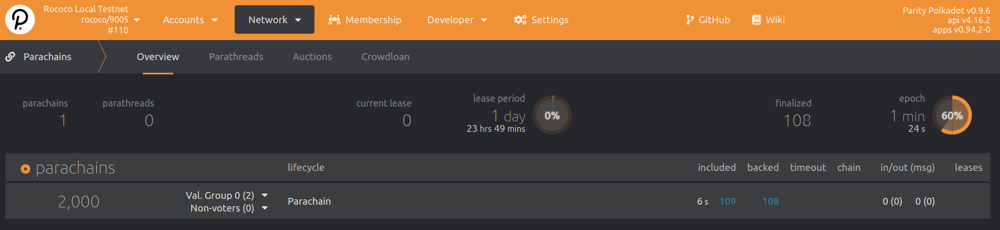

# 注册平行链

我们有我们启动了的中继链，而且我们的平行链收集者准备去注册。现在我们必须在中继链上注册平行链。在实时的Polkadot网络中，
这会通过[平行链-拍卖](https://wiki.polkadot.network/docs/en/learn-auction)来完成。但是现在，我们使用Sudo来完成平行链的注册。

## 注册交易


交易可以在中继链节点**上提交，来自
`Developer > Sudo > parasSudoWrapper > sudoScheduleParaInitialize` 具有以下参数：

- id: `2000`
- genesisHead: upload the file `para-2000-genesis` (from the previous step)
- validationCode: upload the file `para-2000-wasm` (from the previous step)
- parachain: Yes


这个成功的分派将发出 `sudo.Sudid` 事件，可以在中继链浏览器页面中查看。

如果您运行的网络有两个以上的验证器，您可以通过
界面相同，参数相应调整。更重要的细节在
[本教程的后面](en/3-parachains/4-more-nodes)。

### 区块生产

注册完成后，整理者应开始生成平行链块（也称为整理）
成功**，一个新的中继链纪元已经开始**！

> 这可能需要一段时间！请耐心等待，因为您需要先等待新纪元的开始。
> 这是 10 块用于
> [包含洛可可`chain-spec.json`](en/1-prep/2-chain-spec?id=_1a-using-a-prebuilt-chain-spec)
> 在本研讨会的文件中。


# 注意中继纪元的变化！只有这样我们才能开始平行链整理！
#

2021-05-30 17:00:04 [Relaychain] 💤 Idle (2 peers), best: #30 (0xfc02…2a2a), finalized #28 (0x10ff…6539), ⬇ 1.0kiB/s ⬆ 0.3kiB/s    
2021-05-30 17:00:04 [Parachain] 💤 Idle (0 peers), best: #0 (0xd42b…f271), finalized #0 (0xd42b…f271), ⬇ 0 ⬆ 0    
2021-05-30 17:00:06 [Relaychain] 👶 New epoch 3 launching at block 0x68bc…0605 (block slot 270402601 >= start slot 270402601).    
2021-05-30 17:00:06 [Relaychain] 👶 Next epoch starts at slot 270402611    
2021-05-30 17:00:06 [Relaychain] ✨ Imported #31 (0x68bc…0605)    
2021-05-30 17:00:06 [Parachain] Starting collation. relay_parent=0x68bcc93d24a31a2c89800a56c7a2b275fe9ca7bd63f829b64588ae0d99280605 at=0xd42bb78354bc21770e3f0930ed45c7377558d2d8e81ca4d457e573128aabf271
2021-05-30 17:00:06 [Parachain] 🙌 Starting consensus session on top of parent 0xd42bb78354bc21770e3f0930ed45c7377558d2d8e81ca4d457e573128aabf271    
2021-05-30 17:00:06 [Parachain] 🎁 Prepared block for proposing at 1 [hash: 0xf6507812bf60bf53af1311f775aac03869be870df6b0406b2969784d0935cb92; parent_hash: 0xd42b…f271; extrinsics (2): [0x1bf5…1d76, 0x7c9b…4e23]]    
2021-05-30 17:00:06 [Parachain] 🔖 Pre-sealed block for proposal at 1. Hash now 0x80fc151d7ccf228b802525022b6de257e42388ec7dc3c1dd7de491313650ccae, previously 0xf6507812bf60bf53af1311f775aac03869be870df6b0406b2969784d0935cb92.    
2021-05-30 17:00:06 [Parachain] ✨ Imported #1 (0x80fc…ccae)    
2021-05-30 17:00:06 [Parachain] Produced proof-of-validity candidate. block_hash=0x80fc151d7ccf228b802525022b6de257e42388ec7dc3c1dd7de491313650ccae
2021-05-30 17:00:09 [Relaychain] 💤 Idle (2 peers), best: #31 (0x68bc…0605), finalized #29 (0xa6fa…9e16), ⬇ 1.2kiB/s ⬆ 129.9kiB/s    
2021-05-30 17:00:09 [Parachain] 💤 Idle (0 peers), best: #0 (0xd42b…f271), finalized #0 (0xd42b…f271), ⬇ 0 ⬆ 0    
2021-05-30 17:00:12 [Relaychain] ✨ Imported #32 (0x5e92…ba30)    
2021-05-30 17:00:12 [Relaychain] Moving approval window from session 0..=2 to 0..=3
2021-05-30 17:00:12 [Relaychain] ✨ Imported #32 (0x8144…74eb)    
2021-05-30 17:00:14 [Relaychain] 💤 Idle (2 peers), best: #32 (0x5e92…ba30), finalized #29 (0xa6fa…9e16), ⬇ 1.4kiB/s ⬆ 0.2kiB/s    
2021-05-30 17:00:14 [Parachain] 💤 Idle (0 peers), best: #0 (0xd42b…f271), finalized #0 (0xd42b…f271), ⬇ 0 ⬆ 0    
2021-05-30 17:00:18 [Relaychain] ✨ Imported #33 (0x8c30…9ccd)    
2021-05-30 17:00:18 [Parachain] Starting collation. relay_parent=0x8c30ce9e6e9867824eb2aff40148ac1ed64cf464f51c5f2574013b44b20f9ccd at=0x80fc151d7ccf228b802525022b6de257e42388ec7dc3c1dd7de491313650ccae
2021-05-30 17:00:19 [Relaychain] 💤 Idle (2 peers), best: #33 (0x8c30…9ccd), finalized #30 (0xfc02…2a2a), ⬇ 0.7kiB/s ⬆ 0.4kiB/s    
2021-05-30 17:00:19 [Parachain] 💤 Idle (0 peers), best: #1 (0x80fc…ccae), finalized #0 (0xd42b…f271), ⬇ 0 ⬆ 0    
2021-05-30 17:00:22 [Relaychain] 👴 Applying authority set change scheduled at block #31    
2021-05-30 17:00:22 [Relaychain] 👴 Applying GRANDPA set change to new set [(Public(88dc3417d5058ec4b4503e0c12ea1a0a89be200fe98922423d4334014fa6b0ee (5FA9nQDV...)), 1), (Public(d17c2d7823ebf260fd138f2d7e27d114c0145d968b5ff5006125f2414fadae69 (5GoNkf6W...)), 1)]    
2021-05-30 17:00:22 [Relaychain] 👴 Imported justification for block #31 that triggers command Changing authorities, signaling voter.    
2021-05-30 17:00:24 [Relaychain] ✨ Imported #34 (0x211b…febf)    
2021-05-30 17:00:24 [Parachain] Starting collation. relay_parent=0x211b3c53bebeff8af05e8f283d59fe171b7f91a5bf9c4669d88943f5a42bfebf at=0x80fc151d7ccf228b802525022b6de257e42388ec7dc3c1dd7de491313650ccae
2021-05-30 17:00:24 [Parachain] 🙌 Starting consensus session on top of parent 0x80fc151d7ccf228b802525022b6de257e42388ec7dc3c1dd7de491313650ccae    
2021-05-30 17:00:24 [Parachain] 🎁 Prepared block for proposing at 2 [hash: 0x10fcb3180e966729c842d1b0c4d8d2c4028cfa8bef02b909af5ef787e6a6a694; parent_hash: 0x80fc…ccae; extrinsics (2): [0x4a6c…1fc6, 0x6b84…7cea]]    
2021-05-30 17:00:24 [Parachain] 🔖 Pre-sealed block for proposal at 2. Hash now 0x5087fd06b1b73d90cfc3ad175df8495b378fffbb02fea212cc9e49a00fd8b5a0, previously 0x10fcb3180e966729c842d1b0c4d8d2c4028cfa8bef02b909af5ef787e6a6a694.    
2021-05-30 17:00:24 [Parachain] ✨ Imported #2 (0x5087…b5a0)    
2021-05-30 17:00:24 [Parachain] Produced proof-of-validity candidate. block_hash=0x5087fd06b1b73d90cfc3ad175df8495b378fffbb02fea212cc9e49a00fd8b5a0
2021-05-30 17:00:24 [Relaychain] 💤 Idle (2 peers), best: #34 (0x211b…febf), finalized #31 (0x68bc…0605), ⬇ 1.0kiB/s ⬆ 130.1kiB/s    
2021-05-30 17:00:24 [Parachain] 💤 Idle (0 peers), best: #1 (0x80fc…ccae), finalized #0 (0xd42b…f271), ⬇ 0 ⬆ 0    
2021-05-30 17:00:29 [Relaychain] 💤 Idle (2 peers), best: #34 (0x211b…febf), finalized #32 (0x5e92…ba30), ⬇ 0.2kiB/s ⬆ 0.1kiB/s    
2021-05-30 17:00:29 [Parachain] 💤 Idle (0 peers), best: #1 (0x80fc…ccae), finalized #0 (0xd42b…f271), ⬇ 0 ⬆ 0    
2021-05-30 17:00:30 [Relaychain] ✨ Imported #35 (0xee07…38a0)    
2021-05-30 17:00:34 [Relaychain] 💤 Idle (2 peers), best: #35 (0xee07…38a0), finalized #33 (0x8c30…9ccd), ⬇ 0.9kiB/s ⬆ 0.3kiB/s    
2021-05-30 17:00:34 [Parachain] 💤 Idle (0 peers), best: #1 (0x80fc…ccae), finalized #1 (0x80fc…ccae), ⬇ 0 ⬆ 0    
2021-05-30 17:00:36 [Relaychain] ✨ Imported #36 (0xe8ce…4af6)    
2021-05-30 17:00:36 [Parachain] Starting collation. relay_parent=0xe8cec8015c0c7bf508bf3f2f82b1696e9cca078e814b0f6671f0b0d5dfe84af6 at=0x5087fd06b1b73d90cfc3ad175df8495b378fffbb02fea212cc9e49a00fd8b5a0
2021-05-30 17:00:39 [Relaychain] 💤 Idle (2 peers), best: #36 (0xe8ce…4af6), finalized #33 (0x8c30…9ccd), ⬇ 0.6kiB/s ⬆ 0.1kiB/s    
2021-05-30 17:00:39 [Parachain] 💤 Idle (0 peers), best: #2 (0x5087…b5a0), finalized #1 (0x80fc…ccae), ⬇ 0 ⬆ 0  
```

### 整理器数据库损坏或丢失

>注意：您的唯一整理者是_所有平行链数据的唯一宿主_，因为只有一个节点
>在您的整个网络上！中继链仅存储_header_信息！如果parachian DB丢失了
>（我以用`--tmp`为例，作为您的整理者），您将**无法**恢复链！

如果您必须清除链，则需要注销并重新注册！测试可能会更容易
而是清除所有链条。要清除整理DB，请运行：

```bash
# 清除整理器
parachain-collator purge-chain\
  --base-path <your collator DB path set above> \  # <-- set a proper path

# 清除验证器
polkadot purge-chain\
  --base-path <your collator DB path set above> \  # <-- set a proper path
```

然后再次从 [blank slate](#registration-transaction) 注册。

### Parachian 块完成

中继链跟踪每个平行链的最新区块（头部）。当一个中继链块
最终确定，任何已经完成的平行链区块
[验证过程]（https://polkadot.network/the-path-of-a-parachain-block/）也已完成。
这就是 Polkadot 实现共享安全的方式。

我们可以跟踪注册了哪些平行链以及它们最新的头部数据在
应用程序 UI 中的“网络 > 平行链”选项卡。



### 平行链区块完成
中继链跟踪每个平行链的最新区块（头部）。当中继链阻塞时
完成后，所有完成了
[validation process](https://polkadot.network/the-path-of-a-parachain-block/) 也完成了。
这就是Polkadot实现共享安全性的方式。


我们可以跟踪记录了哪些平行链以及它们最新的头部数据在
Apps UI中的“网络>平行链”标签。

