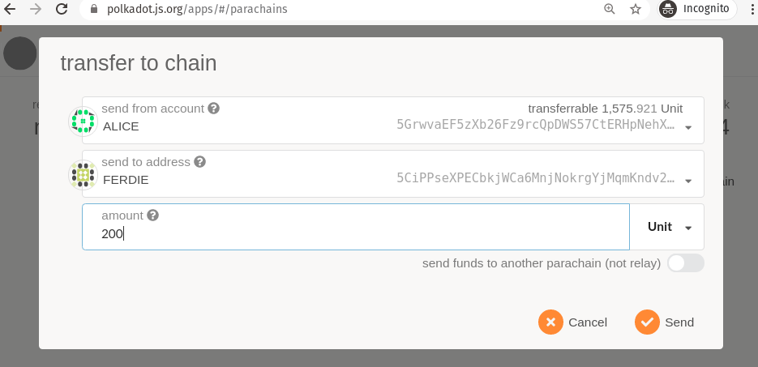

# 向上转账

之前我们给一个平行链转了DOTs。当它们在平行链上，您可以对它们做任何平行链允许的事情。最终您可能想要将DOTs转回到中继链。
这个向上转账可以发生在平行链上任何带DOTs的账户，而不用管是否是最初收到资金的账户。
Previously we transferred DOTs to a parachain. While they are on the parachain, you can do anything
the parachain allows with them. Ultimately you may want to transfer the DOTs back to the relay
chain. This upward transfer can happen from any account with DOTs on the parachain regardless of
whether it was the account that originally received the funds.

## 向上发送代币

要将在平行链上的Alice账户发送代币到中继链的Ferdie账户，您可以在平行链上提交一笔交易。去到连接到平行链的Apps实例，导航到平行链的选项，然后单击"给链转账" 按钮。

填写您需要填写的详情信息并提交交易。仔细注意右下角的波动开关。请确保它是不能用的，这样代币才能进入到中继链中，而不是其它的平行链。
Fill in the details as you desire and submit the transaction. Take careful note of the toggle switch
in the bottom right. Make sure it is disable so the tokens go to the relay chain, not another
parachain.

## 确认收到的DOTs

返回到中继链，检查账户栏，确保DOTs已经安全到达。
Back on the Relay Chain, check the Accounts tab to ensure the DOTs have arrived safely.

## 货币政策

正如我们在上一节中提到的，这个跨链传输方案使用了质押和铸币模型。中继链最终负责控制DOTs的供应。然而，中继链不能控制单个平行链的语义。
完全有可能的是平行链允许用户随意创建代币。这些代币应该不能被传输回中继链并削弱DOT供应。

中继链执行的不变条件是，不能再有任何代币从平行链传输出去，而是进入平行链。中继链知道有多少代币进入到平行链中，因为它是存储在平行链仓库中的代币数量。

## 更多玩法

尝试一下从平行链转出比转入更多的代币。会发生什么？
Try transferring more tokens out of a parachain than you transferred into it. What happens?
