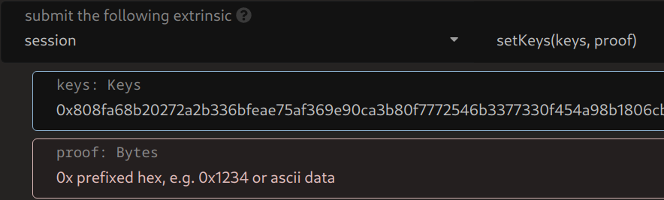

# 注册一个Rococo平行链

Rococo是基于Cumulus的平行链，是Parity的官方测试网。这篇文档的目的是引导Cumulus平行链开发者在Rococo测试网通过必要的步骤去注册他们的平行链。
本页在主要工作间商是一个 _addendum_。在您想要在公共的测试网，像Rococo，去注册您自己的平行链时，我们希望您已经走完了全部的工作间，而且可以通过我们的
[#Rococo Element chat room](https://app.element.io/#/room/!WuksvCDImqYSxvNmua:matrix.parity.io?via=matrix.org)联系我们。


## 编写您的平行链

您已经在[Parachain Template Overview](../5-develop/1-template-overview.md)和[Template Pallet](../5-develop/3-template-pallet.md)部分包含了这份材料。


## 测试您的平行链

您已经在[Sending Messages](../5-develop/4-sending-messages.md)和[Receiving Messages](../5-develop/5-receiving-messages.md)部分包含了这份材料。


## 索要ROC代币

Rococo测试网的本地货币标志是ROC。为了注册您的Rococo平行链，您需要一些ROC。被要求质押去注册平行链(当前是 1,000ROC)，而且您也需要一些额外的ROC为了支付交易费用。
请使用我们的[#Rococo Element chat room](https://app.element.io/#/room/!WuksvCDImqYSxvNmua:matrix.parity.io?via=matrix.org)索取ROC代币。


## 准备Rococo验证者节点

为了注册个Rococo测试网的平行链。我们要求您至少运行两个Rococo验证者节点去支持主要的Rococo中继链。


### 构建验证者节点

在正式的测试网，您应该构建`rococo-branch`的内部，而不是在这个工作间使用的固定的提交。


参考第一章节去学习如何[build a Rococo validator node](../1-prep/1-compiling.md#building-a-relay-chain-node)，但是请确保您`git checkout rococo-branch`。


### 准备验证者节点

准备每一个Rococo的验证者节点，通过运行下面的命令：

```shell
polkadot --chain rococo --validator --wasm-execution=Compiled
```

您将需要给每一个Rococo验证者节点生成会话密钥。使用`author.rotateKeys` RPC call给一个节点生成keys。
一种方式是通过使用`curl`去调用这个RPC方法：

```shell
curl http://<validator address>:<WebSocket port>\
  -H "Content-Type:application/json;charset=utf-8"\
  -d '{ "jsonrpc":"2.0", "id":1, "method":"author_rotateKeys" }'
```

您也可以使用 [Polkadot JS Apps UI RPC app](https://polkadot.js.org/apps/#/rpc)去调用RPC方法。只是要确保您连接到了正确的节点。
不管您是生成这些keys的，注意它们和小心对待它们 - 当您给平行链注册提交您的请求时，您需要提供它们。

You need to provide the **ValidatorId** when you submit your request for parachain registration.
In order to generate a ValidatorId, you must call the `SetKeys` extrinsic from the **session** pallet.
In the **keys** field you will provide the keys generated in the previous step.
The **proof** field will be ignored so you can write any text you want.



## 请求平行链注册

在[Chapter 3, Section 2](../3-parachains/2-register.md)，我们在开发中的中继链使用Sudo托盘去注册一条平行链。
真实的Rococo中继链使用[the Propose Parachain pallet](https://github.com/paritytech/polkadot/blob/rococo-branch/runtime/rococo/src/propose_parachain.rs)
去允许平行链开发者去请求平行链注册。使用[Polkadot JS Apps UI Extrinsics app](https://polkadot.js.org/apps/#/extrinsics?rpc=wss://rococo-rpc.polkadot.io)
在Rococo中继链去调用可调度的`proposeParachain.proposeParachain`，以及提供了下面的参数：


- `para_id`: the ID of your parachain
- `name`: a hex-encoded name for your parachain
- `validation_function`: the Wasm runtime for your parachain
- `initial_head_state`: your parachain's genesis state
- `validators`: two validators from the previous step
- `balance`: the constant value `1000`

请告诉我们您什么时候已经提交了这个请求 (use the Element chat room)，而且我们会尽力在一两天内给您答复。
Let us know when you have submitted this request (use the Element chat room), and we will do our
best to get back to you within a day or two.
