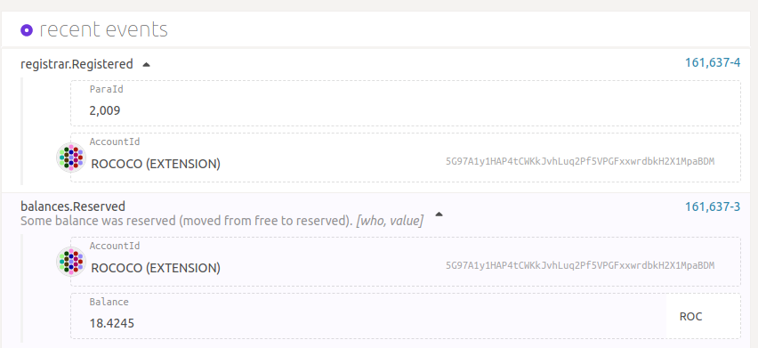
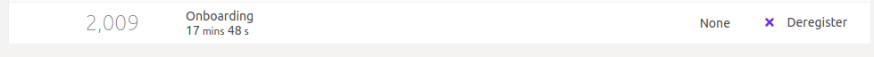
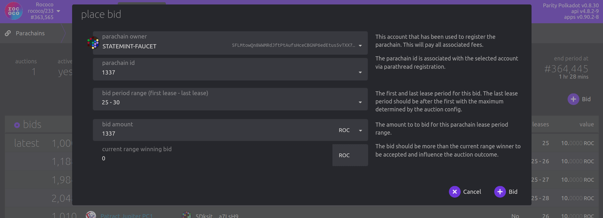

# Rococo

## 注册

Rococo 是基于 Cumulus 的平行链，是 Parity 的官方测试网。

> **重要信息** 您必须使用与cumulus and polkadot `v0.9.3分支相同的comit来构建你的平行链才能兼容！！！在你试图链接到rococo之前必须在本地成功的注册你的平行链。

**[Polkadot `release-v0.9.3` branch](https://github.com/paritytech/polkadot/tree/release-v0.9.3)**

**[Cumulus `polkadot-v0.9.3` branch](https://github.com/paritytech/cumulus/tree/polkadot-v0.9.3)**

该网路正在不断的发展中，因此如果您希望与网路连接，请期待您的平行链随 rococo 的变化而发展和更新。

加入 [rococo matrix chat room](https://matrix.to/#/#rococo:matrix.parity.io)向 rococo 团队提问和联系。

## 索要 ROC 代币

Rococo 测试网络的本地货币的符号是 ROC。您将需要一些 ROC 才能
注册您的洛可可平行链。

要在 Rococo _before_ 上进行实验，您需要注册，并鼓励您的团队作为支持者
诸如 Rococo 上的众筹之类的事情，请**不要**使用主聊天，而是*请*使用我们的
[rococo faucet channel](https://matrix.to/#/#rococo-faucet:matrix.org) 请求一些 ROC 令牌。

由于您将需要比水龙头实际允许注册的更多，请加入并询问
[Rococo matrix 聊天室](https://matrix.to/#/#rococo:matrix.parity.io)，Parity 团队之一
如果您让我们知道（有一些证据）您已经准备好注册平行链，我们将帮助您进行设置。

[请求一些 ROC](en/6-register/1-register?id=request-roc-tokens) 首先通过水龙头获得一个帐户。

### 注册成为 Parathread

所有平行链都需要注册。有 5 个 ROC 存款来注册平行链 id。

- [Reserve a _unique_ `para_id`](en/2-relay-chain/2-reserve)。这将被分配到下一个
  可用 ID。
- 该整数将大于`2000`，因为`0-999`是系统平行链和
  `1000-1999` 是 _reserved_ 共同利益的平行链。
- `initial_head_state`：你的平行链的创世状态（[与以前相同的过程]（../3-parachains/1-launch.md#generate-parachain-genesis-state））
- `validation_function`：平行链的 Wasm 运行时（[与以前相同的过程](../3-parachains/1-launch.md##obtain-wasm-runtime-validation-function)）

[应用 UI 在这里](https://polkadot.js.org/apps/?rpc=wss%3A%2F%2Frococo-rpc.polkadot.io#/parachains/parathreads)

保留下一个可用的平行链 ID。

成功保留您的 para id 后，您现在可以注册 **ParaThread**。

如果您的外部成功，您将在资源管理器的块数据中看到：

并且您的平行线程注册是*onboarding*：

> 提交此数据后，需要 **2 个会话**（长度[见下文](#relevant-values)）
> 让候选人完全加入 Parathread。

## 平行链 slot 拍卖

Paratheads 可以选择成为平行链，它们在中继链中的 PoV 包含在
在分配的时间段内保证。系统平行链将绕过拍卖，但
所有普通链（包括你的）都需要赢得平行链插槽拍卖才能获得一个！

> 只有完全加入的洛可可式平行线程才有资格参加洛可可式平行链 slot 拍卖。

### 相关值

> 请注意，这些是示例值；一切都可能发生变化。

- 会话长度：10 分钟
- 租期长度：1 天 = 14400 块
- 结束时间：60 分钟 = 600 块
- 当前租赁期指数 = 当前区块编号 / 14400

> 注意：Para\* 到不同状态的所有转换至少需要 2 个会话（入职、
> 下线、升级、降级等

### 投标

任何已注册**完全入职平行链**的人都可以竞标以赢得其 Para ID 的平行链插槽。
这可以独立完成，假设这个个人账户可以出价超过所有其他参与
插槽拍卖。
通过 [apps UI](https://polkadot.js.org/apps/?rpc=wss%3A%2F%2Frococo-rpc.polkadot.io#/parachains/auctions) 执行此操作：

选择您的 Para ID、您想出价多少以及您想出价的位置：

###众筹

如果您*不能*（或宁愿不）使用您在单个帐户中拥有的 ROC 赢得一个位置，您
必须获得洛可可社区的支持并开始众筹，您的支持者可以
借给您他们的 ROC 以赢得拍卖。

#### 开始众筹

重要笔记：

- 您只能为您拥有/已注册的 Para ID 创建众包。
- 众筹上限是您的众筹可以收集的最大金额。如果您仍然可以中标
  只要您的出价在拍卖中是最好的，就可以低于您的最大值。
- Ending Block 是您希望众筹结束的时间。如果你知道拍卖会在 3 天后开始，
  并且将持续 5 天，您可能希望将众筹设置为在 10 天后结束，或类似的
  时间表。这样您就可以确保您的众筹在整个拍卖过程中都处于活跃状态
  过程。
- 众筹时间不要设置太长，否则会锁定用户资金
  时间长了，他们可能不想参加。
- 第一个位置必须是您要竞标的第一个位置。所以如果当前的拍卖是针对老虎机的
  (3, 4, 5, 6)，您的第一个槽位至少可以是 3。
- 最后一个插槽也必须在该范围内。
- 只要您没有收到捐款，您就可以取消众筹（如果您犯了错误）。

如果您的外部成功，您将获得：

#### 为众筹提供资金

任何拥有免费 ROC 余额并选择为您的众贷做出贡献的账户，包括
开始此众筹的同一帐户从
[应用界面](https://polkadot.js.org/apps/?rpc=wss%3A%2F%2Frococo-rpc.polkadot.io#/parachains/crowdloan)：

#### 为众筹提供资金

任何拥有免费 ROC 余额并选择为您的众筹做出贡献的账户，包括
开始此众筹的同一帐户从
[应用界面](https://polkadot.js.org/apps/?rpc=wss%3A%2F%2Frococo-rpc.polkadot.io#/parachains/crowdloan)：

在[rococo matrix聊天室](https://matrix.to/#/#rococo:matrix.parity.io)上传播关于
您的平行链，并集结支持，让其他人借给您赢得 slot 所需的资金！
